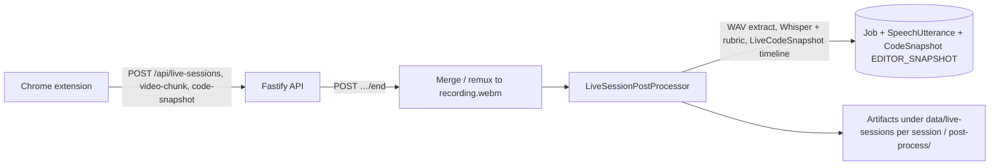

# Ai Interview Copilot

Backend service for **live LeetCode sessions**: the extension captures **tab video + mic + periodic editor code snapshots**; after **`/end`**, the server merges WebM with **ffmpeg**, runs **speech-to-text** (Whisper) and a structured **rubric evaluation** (LLM) on the same timeline. **Tesseract is not used.** Poll **`GET /api/interviews/:id`** for results. Classic **`POST /api/interviews`** file upload has been removed.

The **Chrome** extension under **`browser-extension/chrome/`** starts sessions from **leetcode.com** problems, records via the **side panel** (mic + tab), uploads chunks to the server, and opens a **sessions** report page (video, transcript, dimensions, moment-by-moment feedback).

## Repository layout

| Path | Purpose |
|------|---------|
| `server/` | Node.js + Fastify app, Prisma (SQLite), live-session merge/remux, STT/eval, prompts |
| `server/tst/` | Vitest unit tests |
| `browser-extension/chrome/` | Chromium MV3 build: popup, side panel recorder, LeetCode content script, local **Sessions** UI |
| `browser-extension/firefox/` | Reserved for a future Firefox build |
| `demo/` | README screenshots, animated GIF preview, and muted MP4 walkthrough; not used by the server |
| `server/media/` | Optional local files for pipeline/API tests (ignored by git except `.gitkeep`) |
| `server/DESIGN.md` | **Detailed** server design (architecture, pipeline, Prisma, FFmpeg deep dive). |

## Prerequisites

- **Node.js** 20+ (see [`.nvmrc`](./.nvmrc); 22 recommended)
- **ffmpeg** & **ffprobe** (merge WebM, WAV extract, stitch)
- **OpenAI API key** for remote Whisper and (by default) evaluation (Anthropic optional for eval)

## Installation

### Option A — Release installer (recommended for end users)

**One command** (no env vars): installs under `~/.local/share/ai-interview-copilot` from **`pramod-123/AiInterviewCopilot`** **`latest`** release, using the **public GitHub API** (no GitHub token). This form keeps interactive prompts (LLM provider + API keys) in a normal terminal.

```bash
bash -c "$(curl -fsSL https://raw.githubusercontent.com/pramod-123/AiInterviewCopilot/main/install.sh)"
```

From a **clone** (interactive: keys, LLM menu, optional venvs):

```bash
./install.sh
```

### Option B — Developers (from this repo)

```bash
./install-dev.sh          # npm ci, prisma, start dev server (optional: --brew on macOS for ffmpeg)
# or see Quick start below for manual steps
```

More detail: [`CONTRIBUTING.md`](./CONTRIBUTING.md).

## Quick start

```bash
cd server
cp .env.example .env
# Edit .env: set OPENAI_API_KEY and any optional overrides

npm ci
npx prisma generate
npx prisma db push

npm run dev
```

Server listens on `http://127.0.0.1:3001` by default (`PORT` / `HOST` in `.env`).

## API keys and tokens

Set these in `server/.env` (or via installer prompts) depending on your provider choices:

- `OPENAI_API_KEY` (recommended default): used for remote STT (`whisper-1`) and OpenAI-backed evaluation.
- `ANTHROPIC_API_KEY` (optional): used when `LLM_PROVIDER=anthropic`.
- Live session post-process prefers **`live-bridge-transcription/realtime-transcriptions.jsonl`** when the voice bridge is enabled, and writes **`post-process/transcript.srt`** from that transcript; otherwise it uses local or remote STT on tab/mic audio only (no LLM speaker-role labeling).
- `GEMINI_API_KEY` (optional): enables Gemini Live WebSocket interviewer features (default when `LIVE_REALTIME_PROVIDER` is unset or `gemini`). With `LLM_PROVIDER=gemini`, set **`GEMINI_MODEL_ID`** (text/chat for evaluation; distinct from **`GEMINI_LIVE_MODEL`** for voice).
- `OPENAI_REALTIME_MODEL` (optional): required when `LIVE_REALTIME_PROVIDER=openai` — Realtime model id (e.g. `gpt-4o-realtime-preview-2024-12-17`). Uses the same `OPENAI_API_KEY` as other OpenAI features.

Where to get each key:

- OpenAI: [platform.openai.com/api-keys](https://platform.openai.com/api-keys)
- Anthropic: [console.anthropic.com/settings/keys](https://console.anthropic.com/settings/keys)
- Gemini (Google AI Studio): [aistudio.google.com/app/apikey](https://aistudio.google.com/app/apikey)

Notes:

- For the live voice bridge, set `LIVE_REALTIME_PROVIDER=openai` to use OpenAI Realtime (otherwise Gemini Live with `GEMINI_API_KEY` + `GEMINI_LIVE_MODEL`). Optional: `OPENAI_REALTIME_VOICE` (default `alloy`).
- If you use Anthropic for evaluation, set `LLM_PROVIDER=anthropic`. For Gemini text evaluation and tool agents, set `LLM_PROVIDER=gemini`, `GEMINI_API_KEY`, and `GEMINI_MODEL_ID`.
- If you use local STT, set `STT_PROVIDER=local` and keep `LOCAL_WHISPER_EXECUTABLE` configured.
- Keep `.env` private and never commit real keys.

## Browser extension (LeetCode live capture)

1. Start the server (`npm run dev` in `server/`).
2. Chrome → **Extensions** → **Developer mode** → **Load unpacked** → select the repo’s **`browser-extension/chrome/`** folder.
3. Open a **`https://leetcode.com/problems/...`** tab, click the extension icon, set **API base URL** if needed (default `http://127.0.0.1:3001`), then **Start interview** (opens the **side panel** for tab capture + microphone).
4. After you **End session on server**, open **Sessions** from the popup to review the merged **WebM**, **transcript**, **dimensions** analysis, and **moment-by-moment** feedback (timestamps seek the video and highlight transcript lines).

Problem text is scraped from the LeetCode page (DOM + `__NEXT_DATA__`); editor code prefers **Monaco** in the page (full buffer) with DOM fallback.

## Demo

Toolbar **popup** (API base URL, mic hint, **Start interview** / **Sessions**):


**Side panel** during capture (status, compact log, Start / Stop / End session):


**Screen recording** — walkthrough of the analysis / sessions experience (muted). **Animated preview** (GIF; larger file, works everywhere on GitHub):


**Higher quality (H.264 MP4)** — GitHub’s README does not reliably load `<video>` with a **relative** `src`, so the player uses `raw.githubusercontent.com` on **`main`** (forks: change `OWNER/REPO`, or open [`demo/interview-analysis.mp4`](demo/interview-analysis.mp4) locally).

<video controls muted playsinline preload="metadata" width="720">
  <source
    src="https://raw.githubusercontent.com/pramod-123/AiInterviewCopilot/main/demo/interview-analysis.mp4"
    type="video/mp4"
  />
</video>

**Direct links:** [MP4 on `main`](https://raw.githubusercontent.com/pramod-123/AiInterviewCopilot/main/demo/interview-analysis.mp4) · [`demo/interview-analysis.mp4`](demo/interview-analysis.mp4) in the tree

## HTTP API (summary)

**Interview jobs (poll)**

- **`GET /api/interviews/:id`** — status and, when ready, `result` (STT + evaluation). **`POST /api/interviews`** (uploaded video jobs) has been **removed**; this endpoint is used for jobs created when a **live session** ends. **Speech**: `speechTranscript` (windows with `startMs`, `endMs`, `text`, optional `speaker`). **Code timeline**: `codeSnapshots` (`offsetMs`, `text`, `source` — live sessions use `EDITOR_SNAPSHOT`). `transcripts` aliases `speechTranscript`.

**Live sessions (extension)**

- **`POST /api/live-sessions`** — create session; returns `id`
- **`PATCH /api/live-sessions/:id`** — JSON `{ "question": "..." }` (problem statement while `ACTIVE`)
- **`POST /api/live-sessions/:id/video-chunk`** — multipart field **`chunk`** (WebM slice from `MediaRecorder`)
- **`POST /api/live-sessions/:id/code-snapshot`** — JSON `{ "code", "offsetSeconds" }`
- **`POST /api/live-sessions/:id/end`** — mark **ENDED**, merge/remux chunks to **`recording.webm`**, enqueue **`LiveSessionPostProcessor`** → new **`Job`** linked via `liveSessionId`
- **`GET /api/live-sessions`** — list recent sessions (counts, question preview, post-process job status)
- **`GET /api/live-sessions/:id`** — session metadata, `question`, `recordingWebmPath`, `postProcessJob`
- **`GET /api/live-sessions/:id/recording.webm`** — merged **WebM** (supports **Range** for `<video>`)

## Scripts (from `server/`)

| Command | Description |
|---------|-------------|
| `npm run dev` | Watch mode (`tsx`) |
| `npm run build` | Compile to `dist/` |
| `npm start` | Run compiled app |
| `npm test` | Unit tests |
| `npm run test:coverage` | Tests + coverage report in `coverage/` |
| `npm run lint` | ESLint |
| `npm run typecheck` | TypeScript `--noEmit` |
| `npm run live-session:reset-post-process` | Dev helper: clear post-process link / job for a session id |
| `npm run live-session:reprocess` | Dev helper: re-run live-session → interview job pipeline |

## Configuration

Copy [`server/.env.example`](./server/.env.example) to `server/.env`. Never commit real keys.

## Security

- Keep `.env` out of git (see root [`.gitignore`](./.gitignore)).
- Uploaded artifacts and the SQLite DB live under `server/data/` (ignored by git).
- See [`SECURITY.md`](./SECURITY.md) for reporting vulnerabilities.

## Contributing

See [`CONTRIBUTING.md`](./CONTRIBUTING.md).

## Server design (overview)

The **Node/TypeScript** service under [`server/`](./server/) runs **Fastify** + **Prisma (SQLite)**, requires **ffmpeg** and **ffprobe** on `PATH`, and uses **OpenAI** (and optionally **Anthropic**) for STT and rubric evaluation.

**Data flow (conceptual)**



1. **Live LeetCode session** — extension → **`POST /api/live-sessions`** + chunk/snapshot routes → **`POST …/end`** merges/remuxes to **`recording.webm`** → **`LiveSessionPostProcessor`** creates a **`Job`** (`liveSessionId`), extracts **WAV**, runs **Whisper + rubric** with **extension `LiveCodeSnapshot`** rows as the code timeline → persists **`SpeechUtterance`** + **`CodeSnapshot`** (`EDITOR_SNAPSHOT`); artifacts under **`data/live-sessions/<sessionId>/post-process/`**.

**Low-level design** (goals, diagrams, Prisma field notes, env tables) lives in **[`server/DESIGN.md`](./server/DESIGN.md)**. That document may still mention removed classic video/OCR paths until it is fully revised.

Poll completed jobs with **`GET /api/interviews/:id`** (same id returned when ending a live session).

## License

[MIT](./LICENSE)
