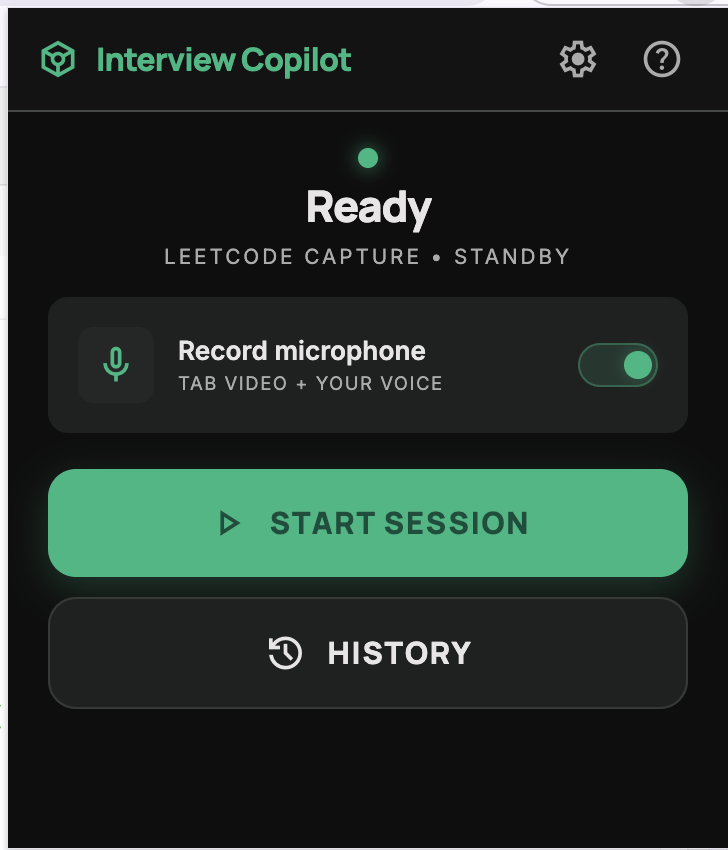
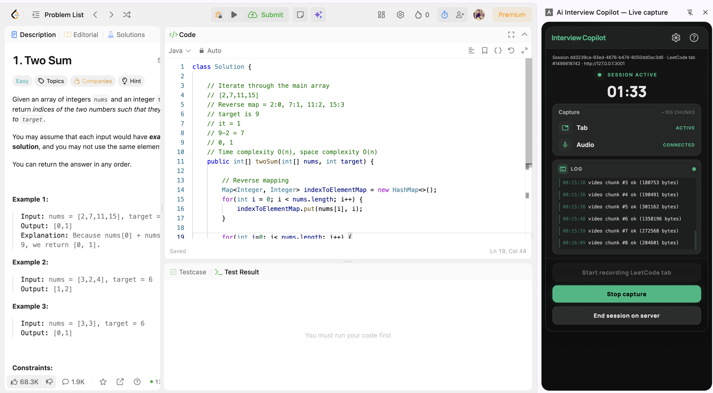
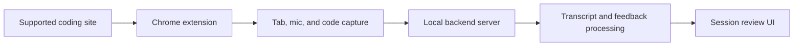

<div align="center">

# InterviewCoach

### Practice live coding interviews with recording, transcription, and AI feedback.

<p align="center">
  <a href="LICENSE">
    
  </a>
  <a href="server/package.json">
    
  </a>
  <a href="browser-extension/chrome/manifest.json">
    
  </a>
  <a href="#installation">
    
  </a>
</p>

An open-source interview practice tool that helps you run realistic mock coding interviews from **LeetCode**, **HackerRank**, **Codeforces**, **AtCoder**, **CodeChef**, and **TopCoder**. InterviewCoach records your browser tab, microphone, and code timeline, then generates a transcript and structured feedback so you can review your performance before the real interview.

[Quick Start](#installation) · [Features](#what-it-does) · [Screenshots](#screenshots) · [How It Works](#how-it-works) · [Configuration](#configuration) · [Documentation](#documentation)

---

</div>

<div align="center">
  
  <p><em>Review a mock coding interview with recording, transcript, code timeline, and AI feedback.</em></p>
</div>

## What It Does

- Records coding practice sessions from supported interview/problem-solving websites.
- Captures tab video, microphone audio, and editor code snapshots during the session.
- Generates a searchable transcript of the conversation.
- Produces AI-assisted feedback on the interview, including strengths, weaknesses, and moment-by-moment notes.
- Lets you review the full session with synchronized video, transcript, code timeline, and feedback.
- Runs locally with a Chrome extension and a local server.
- Supports multiple AI providers for transcription and evaluation workflows.

## Screenshots

### Start A Session

Use the Chrome extension popup to start a new interview session, check microphone status, and open session history.



### Record While You Practice

The side panel stays open while you solve the problem and shows recording status for the tab and microphone.



### Review The Interview

After the session ends, review the recording, transcript, AI feedback, and session details in one place.


For a higher-quality walkthrough, open [`demo/interview-analysis.mp4`](demo/interview-analysis.mp4).

## How It Works



1. Install the local server and load the Chrome extension.
2. Open a supported coding problem.
3. Start the mock interview session from the extension.
4. Solve the problem while InterviewCoach records the tab, microphone, and editor activity.
5. End the session.
6. Review the generated transcript, video, code timeline, and feedback.

## Supported Sites

InterviewCoach is built for common coding interview and competitive programming platforms, including:

- LeetCode
- HackerRank
- Codeforces
- AtCoder
- CodeChef
- TopCoder

Support may vary by page layout and editor implementation. Contributions for additional sites are welcome.

## Installation

### macOS / Linux

Run the installer:

```bash
bash -c "$(curl -fsSL https://raw.githubusercontent.com/pramod-123/AiInterviewCoach/main/install.sh)"
```

The installer downloads the latest release, installs the server, and prompts for the AI provider configuration it needs.

If you cloned the repository locally, you can run:

```bash
./install.sh
```

### Windows

Install [Node.js 20+](https://nodejs.org/), FFmpeg, Python 3.12, and `tar` if needed. Then run PowerShell from the repository:

```powershell
powershell -ExecutionPolicy Bypass -File .\install.ps1
```

You can also download [`install.ps1`](https://raw.githubusercontent.com/pramod-123/AiInterviewCoach/main/install.ps1) directly and run it from PowerShell.

### Developer Setup

For local development:

```bash
./install-dev.sh
```

See [`CONTRIBUTING.md`](./CONTRIBUTING.md) for development notes.

## Load The Chrome Extension

1. Start the local server.
2. Open Chrome and go to `chrome://extensions`.
3. Enable **Developer mode**.
4. Click **Load unpacked**.
5. Select `browser-extension/chrome/` from this repository.
6. Open a supported coding problem and click the extension icon.
7. Start the interview session.

The extension talks to the local server at `http://127.0.0.1:3001` by default.

## Configuration

The installer will guide you through the required setup. Depending on the features and provider you choose, you may need one or more API keys:

- OpenAI: [platform.openai.com/api-keys](https://platform.openai.com/api-keys)
- Anthropic: [console.anthropic.com/settings/keys](https://console.anthropic.com/settings/keys)
- Gemini: [aistudio.google.com/app/apikey](https://aistudio.google.com/app/apikey)

Keep API keys private and never commit `.env` or runtime config files with real secrets.

## Documentation

- [`CONTRIBUTING.md`](./CONTRIBUTING.md) explains how to work on the project.
- [`docs/DESIGN.md`](./docs/DESIGN.md) contains lower-level architecture and server design notes.
- [`SECURITY.md`](./SECURITY.md) explains how to report security issues.

## Responsible Use

InterviewCoach is intended for interview practice, self-review, mock interviews, and learning. Use it only in settings where recording, transcription, and AI assistance are allowed.

## License

[MIT](./LICENSE)
